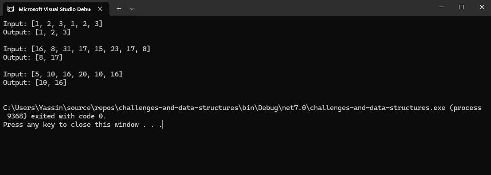

### Whiteboard Images

### Challenge 05: Find-Duplicates.
### Description:
Write a function called FindDuplicates that accepts an array as its parameter. Without utilizing any of the built-in methods provided by the language, the function should return an array of duplicate values.
.

