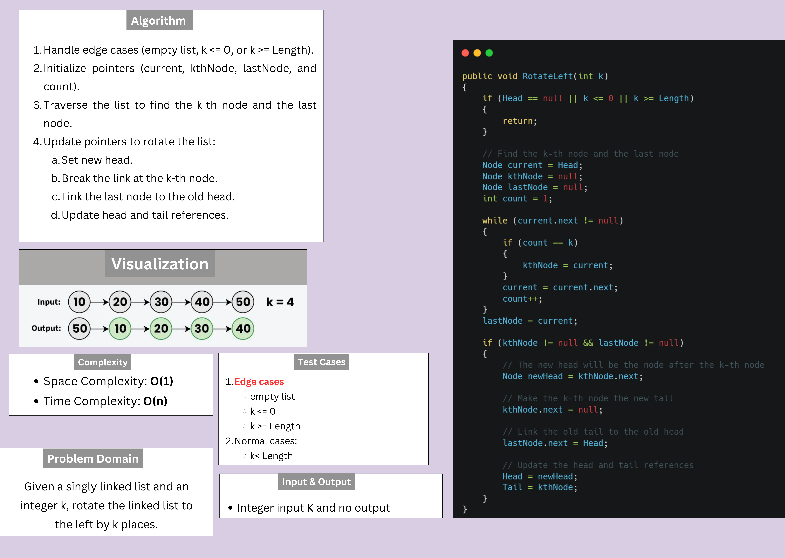

# Linked List - Rotate by K  

## Description

Given a singly linked list and an integer k, rotate the linked list to the left by k places.
After rotating, the node which was originally at position k will now become the head of the list, and the remaining nodes will follow.

## Whiteboard Image

