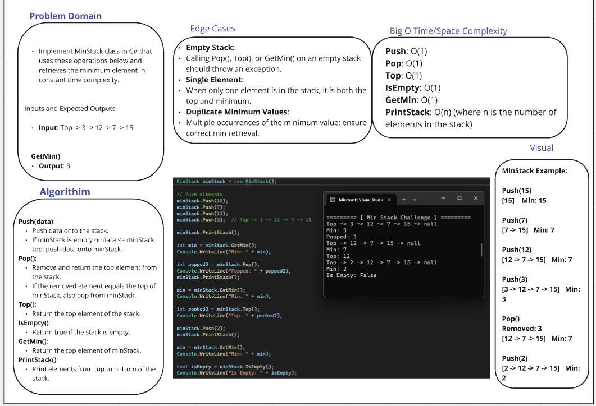

# Adv-cc 12 [ Min Stack Challenge ]

## Description

Implement MinStack class in C# that uses these operations below and retrieves the minimum element in constant time complexity.

## Whiteboard Image

