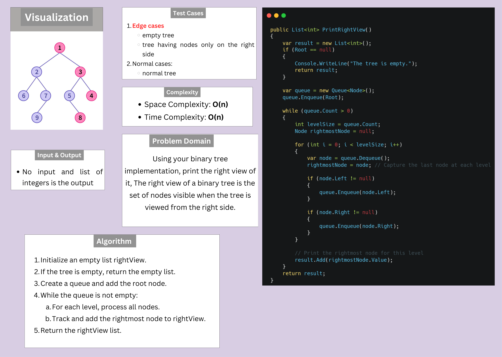

# Challenge

## Description

Using your binary tree implementation, print the right view of it, The right view of a binary tree is the set of nodes visible when the tree is viewed from the right side.

## Whiteboard Image

