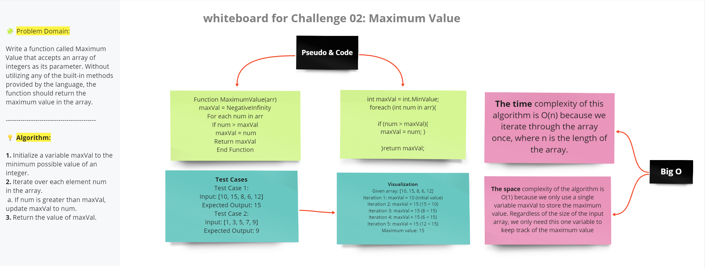

### Whiteboard Images

### Challenge A: Array Reversal
### Description 
This C# program includes a method that takes an integer array and returns the number that appears the most times. If there are no duplicates, it returns the first number in the array. If more than one number shows up the same number of times, it returns the first found.

### Challenge B: Most Frequent Number
### Description 
This C# program includes a function named ArrayReversal that accepts an array as its parameter and returns a new array with the elements in reverse order. The function achieves this without using any built-in methods provided by the C# language.

### Challenge 02: Maximum Value.
### Description:
Write a function called MaximumValue that accepts an array of integers as its parameter.Without utilizing any of the built-in methods provided by the language, the function should return the maximum value in the array.
.

